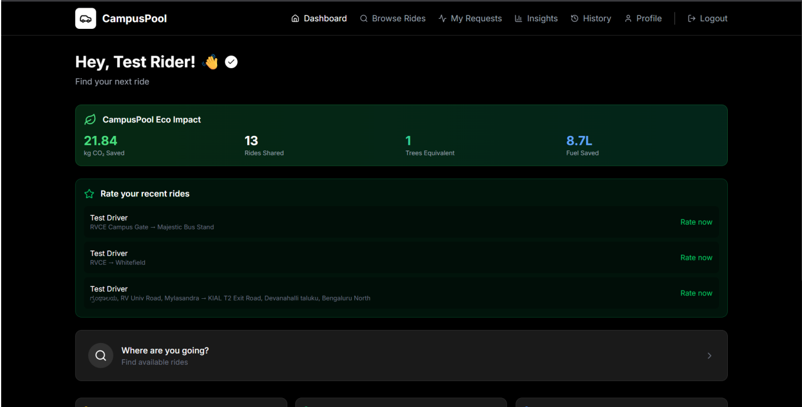
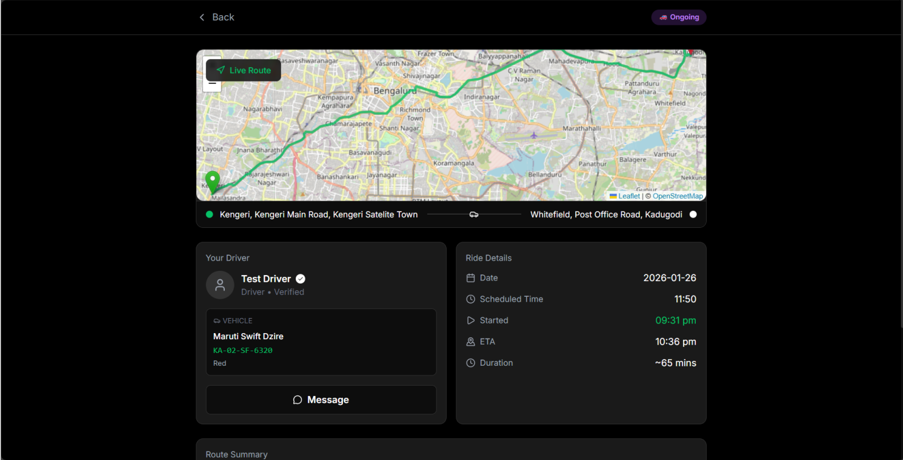
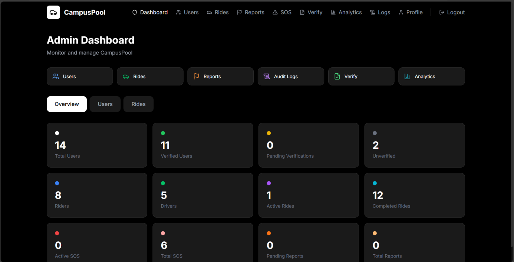

# CampusPool 🚗

> **A Campus-Only Ride-Sharing Platform with Safety and Trust Mechanisms for RVCE**

**Authors:** Tapan Gupta, Suraj Gupta, Sidharth Venugopal, Shreyan Aditya Dash, Badarinath K B, Srividya M S  
**Institution:** Department of Computer Science and Engineering, RV College of Engineering, Bengaluru, India

---

## 🚀 Highlights

- Built a **campus-only ride-sharing platform** for 1000+ students  
- Designed **multi-layer safety system (ID verification + PIN + SOS)**  
- Implemented **real-time ride lifecycle + chat system**  
- Developed **trust scoring algorithm + reputation system**  
- Built **admin dashboard with moderation + audit logs**

---

## 🚨 Problem

Campus ride-sharing is informal, unsafe, and unstructured:
- No identity verification
- No accountability
- No safety guarantees

---

## 💡 Solution

CampusPool is a **closed-campus ride-sharing system** that:
- Restricts access to verified students
- Implements multi-layer trust & safety
- Enables structured ride coordination

---

## Table of Contents

- [Architecture](#architecture)
- [Application Preview](#application-preview)
- [Tech Stack](#tech-stack)
- [Features](#features)
- [Data Model](#data-model)
- [Algorithms](#algorithms)
- [Installation](#installation)
- [Usage](#usage)
- [API Endpoints](#api-endpoints)
- [Evaluation](#evaluation)
- [Limitations and Future Work](#limitations-and-future-work)
- [Citation](#citation)

---

## Architecture

CampusPool follows a **three-tier, decoupled architecture**:

```
┌─────────────────────┐         HTTP/REST        ┌──────────────────────────┐        ┌─────────────┐
│   React + Tailwind  │ ◄──────────────────────► │     FastAPI Backend      │ ◄────► │   MongoDB   │
│     (Frontend SPA)  │       /api prefix         │  (Python, JWT, passlib)  │        │  Database   │
└─────────────────────┘                           └──────────────────────────┘        └─────────────┘
         │                                                    │
   Student & Admin                              Authentication · Rides · Chat
   Web Clients                                  SOS · Ratings · Admin Actions
```

- **Frontend:** Single-page React app (Tailwind CSS), handles all user-facing flows including onboarding, ride management, live rides, and admin dashboards. No model inference on the client side.
- **Backend:** FastAPI service exposing RESTful endpoints under a common `/api` prefix, initialized with all collections at startup.
- **Database:** MongoDB storing users, rides, ride requests, chat messages, SOS events, ratings, event tags, reports, and audit logs.
- **Deployment:** Container-compatible via environment variables; designed for Kubernetes with ingress routing `/api` to the backend and static assets to the frontend.

---

## Application Preview





---

## Tech Stack

| Layer | Technology |
|-------|-----------|
| Frontend | React, Tailwind CSS |
| Backend | FastAPI (Python) |
| Database | MongoDB (via `pymongo`) |
| Authentication | JWT (`python-jose`), password hashing (`passlib`) |
| Deployment | Kubernetes, Docker containers |

---

## Features

### 🔐 Authentication & Verification
- Sign-up enforces `@rvce.edu.in` email domain — only RVCE members can register
- Passwords stored as secure hashes (never plaintext); sessions managed via JWTs
- Students upload ID card images; admins review and approve/reject through a verification queue
- Role-based access control: regular users, drivers, and administrators have separate permission scopes
- Suspended or disabled accounts are automatically blocked from ride participation

### 🚗 Ride Creation & Discovery
- Drivers create rides with source, destination, optional GPS coordinates, date/time, seats, and estimated cost
- Rides can be linked to RVCE-specific **pickup points** (e.g., main gate, central library)
- Support for **recurrence patterns** (daily, weekdays) for regular commuters
- **Event tags** tie rides to academic calendar events (exams, hackathons, etc.)
- Riders browse a card-based feed filtered by origin, destination, pickup point, time range, or event tag
- Each ride card surfaces the driver's name, verification status, average rating, trust badge, and estimated per-rider cost

### 🛡️ Safety Mechanisms
- **PIN verification:** A random 4-digit PIN is generated when a driver accepts a rider. The rider shares this PIN at pickup; the driver enters it to formally start the ride.
- **SOS alerts:** During any ongoing ride, either participant can trigger an emergency alert. The frontend requests GPS coordinates via browser geolocation and sends them alongside the alert to the backend. Admins view and manage all active SOS events in real time.
- **Ride lifecycle statuses:** pending → accepted → ongoing → completed, with server-side timestamp enforcement at each transition.
- **"Reached safely" confirmation:** Riders explicitly confirm arrival, which triggers the rating workflow and closes the ride.

### ⭐ Trust & Reputation
- Post-ride ratings on a 1–5 star scale with optional text feedback
- Backend enforces: one rating per participant per ride, only for completed rides
- Trust levels computed from average rating and completed ride count (see [Algorithms](#algorithms)):
  - 🔘 **New User** — fewer than 5 completed rides
  - 🟦 **Regular** — sufficient rides, moderate rating
  - 🟢 **Trusted** — avg ≥ 4.0 stars and ≥ 5 completed rides
  - 🔴 **Needs Review** — avg ≤ 2.5 stars
- Community indicators highlight shared academic branch or year between rider and driver

### 🏅 Gamification & Eco Impact
- **Usage badges:** First Ride, Rising Star (5 rides), Road Warrior (10 rides), Campus Hero
- **Eco badges:** CO₂ savings estimated from ride count × average distance × emission factor; Eco Warrior and Eco Champion awarded at defined thresholds
- **Ride streaks:** longest and current consecutive-day streaks computed from ride history
- **Weekly summaries:** rides, CO₂ saved, and estimated cost savings over a sliding 7-day window

### 🛠️ Administrator Dashboard
- Verification queue with ID image review and approve/reject controls
- SOS event management: view active alerts, drill into ride/participant details, annotate, and resolve
- User reports: review safety or conduct issues; warn, suspend, or disable accounts
- Audit log: every administrative action is recorded with actor, target, action type, and timestamp

---

## Data Model

| Collection | Key Fields |
|------------|-----------|
| `users` | email, name, password hash, role, admin flag, verification status, academic branch/year, account status |
| `rides` | driver ID, source, destination, coordinates, date/time, seats, cost, pickup point, recurrence, event tag, status |
| `ride_reqs` | ride ID, rider ID, status (pending→accepted→ongoing→completed), PIN, start time, safe arrival time, urgency flag |
| `chat_msgs` | ride request ID, sender ID, message text, timestamp |
| `sos_events` | ride request ID, triggered by, GPS coordinates, message, status, admin notes, resolution time |
| `ratings` | ride request ID, rater ID, rated user ID, rating score, feedback text, timestamp |
| `event_tags` | name, description, active status |
| `reports` | reporter ID, reported user ID, ride ID, category, description, status |
| `audit_logs` | admin ID, action type, target type, target ID, details, timestamp |

---

## Algorithms

### Trust Level Computation

```
Input:  average_rating (float | None), completed_ride_count (int)
Output: {level, label, color}

Thresholds:
  new_user_max_rides    = 4
  trusted_min_rating    = 4.0
  trusted_min_rides     = 5
  needs_review_max_rating = 2.5

Logic:
  if ride_count < new_user_max_rides:
      → "New User" (gray)
  elif avg_rating < needs_review_max_rating:
      → "Needs Review" (red)
  elif avg_rating >= trusted_min_rating AND ride_count >= trusted_min_rides:
      → "Trusted" (green)
  else:
      → "Regular" (blue)
```

### Badge & CO₂ Estimation

CO₂ saved is estimated as:

```
co2_saved_kg = completed_rides × avg_ride_distance_km × emission_factor_kg_per_km
```

Eco badges are awarded when `co2_saved_kg` crosses defined thresholds (configured as backend constants).

### Ride Streak Calculation

The backend collects all unique dates of completed rides for a user, sorts them, and scans sequentially for the longest run of consecutive calendar days. The current streak counts backwards from today.

### Weekly Summary

Rides within the last 7 calendar days are aggregated for completed ride count, CO₂ saved, and estimated monetary savings (solo-travel cost per km × avg distance vs. actual per-rider cost).

---

## Installation

### Prerequisites
- Python 3.9+
- Node.js 18+
- MongoDB (local or Atlas)

### Backend Setup

```bash
# Clone the repository
git clone https://github.com/<your-repo>/campuspool.git
cd campuspool/backend

# Create and activate virtual environment
python -m venv venv
source venv/bin/activate        # Windows: venv\Scripts\activate

# Install dependencies
pip install -r requirements.txt

# Configure environment variables
cp .env.example .env
# Edit .env:
#   MONGO_URL=mongodb://localhost:27017
#   DB_NAME=campuspool
#   SECRET_KEY=your_jwt_secret_key
#   ADMIN_EMAIL=admin@rvce.edu.in
#   ADMIN_PASSWORD=securepassword
```

### Frontend Setup

```bash
cd ../frontend

# Install dependencies
npm install

# Configure environment variables
cp .env.example .env
# Edit .env:
#   REACT_APP_BACKEND_URL=http://localhost:8000
```

---

## Usage

### Start the Backend

```bash
cd backend
uvicorn main:app --reload --port 8000
```

### Start the Frontend

```bash
cd frontend
npm start
```

The app will be available at `http://localhost:3000`.

### Docker / Kubernetes Deployment

```bash
# Build and run containers
docker-compose up --build
```

For Kubernetes, configure ingress rules to route `/api/*` to the FastAPI service and all other paths to the React frontend container.

---

## API Endpoints

| Method | Endpoint | Description |
|--------|----------|-------------|
| POST | `/api/auth/signup` | Register with `@rvce.edu.in` email |
| POST | `/api/auth/login` | Login, receive JWT |
| GET | `/api/auth/me` | Get current user profile |
| GET/PUT | `/api/profile` | View or update profile / upload ID image |
| POST | `/api/rides` | Create a ride (drivers only) |
| GET | `/api/rides` | Search/browse available rides |
| PUT | `/api/rides/{id}` | Update or cancel a ride |
| POST | `/api/ride-requests` | Submit a ride request (riders) |
| PUT | `/api/ride-requests/{id}/accept` | Accept a rider request (driver) |
| POST | `/api/ride-requests/{id}/verify-pin` | Verify pickup PIN to start ride |
| GET/POST | `/api/chat/{request_id}` | Retrieve or send chat messages |
| POST | `/api/sos` | Trigger SOS alert with optional GPS |
| POST | `/api/ratings` | Submit post-ride rating |
| GET | `/api/admin/verify` | Admin: view verification queue |
| PUT | `/api/admin/verify/{user_id}` | Admin: approve or reject verification |
| GET | `/api/admin/sos` | Admin: view active SOS events |
| PUT | `/api/admin/sos/{id}` | Admin: annotate and resolve SOS event |
| GET | `/api/admin/reports` | Admin: view user reports |
| PUT | `/api/admin/users/{id}/status` | Admin: warn, suspend, or disable user |
| GET | `/api/admin/audit-logs` | Admin: view full audit log |

---

## Evaluation

### Performance Targets (Planned Pilot)

| Endpoint | Median Latency | 95th Percentile | Throughput |
|----------|---------------|-----------------|------------|
| `/api/auth/login` | 45 ms | 120 ms | 260 req/s |
| `/api/rides/search` | 60 ms | 150 ms | 220 req/s |
| `/api/ride-requests` | 70 ms | 170 ms | 200 req/s |
| `/api/sos` | 40 ms | 100 ms | 240 req/s |

### User Study Targets (Planned, Likert 1–5)

| Question | Target Mean |
|----------|------------|
| Ease of ride creation | 4.3 |
| Ease of ride discovery | 4.1 |
| Perceived safety | 4.0 |
| Trust in other users | 3.8 |
| Likelihood of continued use | 4.2 |

The planned evaluation includes pilot deployment with RVCE student volunteers, load testing via concurrent request generators, and semi-structured user interviews probing trust badge interpretation and safety feature credibility.

---

## Limitations and Future Work

**Current limitations:**
- Ride matching is search-based; riders find rides manually rather than through automated suggestions
- CO₂ and cost savings use heuristic constants (average distance, emission factor) rather than real routing data
- The system is designed for RVCE only; multi-campus deployment would require data partitioning and cross-campus trust policies
- Long-term retention of ride histories, chat logs, and SOS events requires formal privacy and data minimization policies

**Planned future work:**
- Dynamic ride matching algorithms supporting detour optimization and multi-hop routes
- Integration with mapping/routing APIs for accurate distance, duration, and real-time tracking
- Generalization to other campuses with configurable institutional authentication
- Formal privacy controls: data retention policies and user consent mechanisms
- k-fold and cross-campus evaluation of trust and safety algorithms

---

## Citation

If you use this work, please cite:

```bibtex
@inproceedings{gupta2025campuspool,
  title={CampusPool: A Campus-Only Ride-Sharing Platform with Safety and Trust Mechanisms for RVCE},
  author={Gupta, Tapan and Gupta, Suraj and Venugopal, Sidharth and Dash, Shreyan Aditya and K B, Badarinath and M S, Srividya},
  institution={Department of Computer Science and Engineering, RV College of Engineering, Bengaluru, India},
  year={2025}
}
```

---

## Acknowledgements

The authors thank the students, faculty, and administration of RV College of Engineering for their support and feedback during the design of CampusPool.

---

*Department of Computer Science and Engineering, RV College of Engineering, Bengaluru, India*
